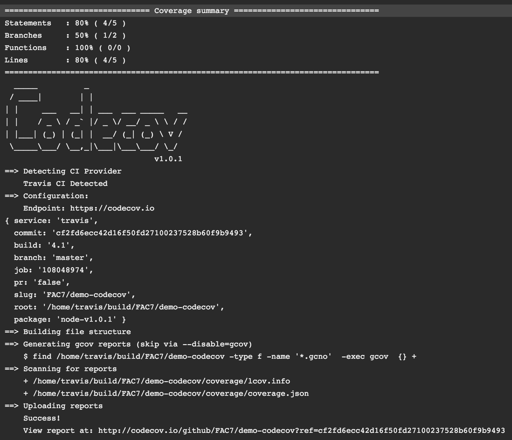

# CodeCov.io Demonstration
[CodeCov.io](http://codecov.io) is a service that automatically presents code coverage reports generated by continuous integration builds. This tutorial will take you through setting up a Travis CI build and subsequently generating a code coverage report for it.

#### First Steps
Create a new repository on GitHub with a Node `.gitignore`. Clone this repo and initialise a node project with

```sh
npm init
```

(Add the `--y` flag to skip filling in the package.json file and inputs blanks)

Then install `codecov` and `istanbul` as developer dependencies with the command

```sh
npm install codecov --save-dev
npm install istanbul --save-dev
```

Then in the `scripts` field of package.json, add

```javascript
"test": "node ./node_modules/.bin/istanbul cover test.js && ./node_modules/.bin/codecov"
```

Let's break down what's happening in this command. Firstly, with `node ./node_modules/.bin/istanbul cover test.js` we are running the istanbul code coverage generator on the `test.js` file. See [this](https://github.com/dwyl/learn-istanbul) tutorial for more on how Istanbul works.

If that executes successfully, the `codecov` script is executed. It will scan for code coverage reports and then send them off to the CodeCov API.

Just for reference, you can see our (rather trivial) `test.js` file below.

```javascript
var x = 1, z;

var y = 3*x;

if (y > 20) {
    z = 5;
} else {
    z = 7;
}
```

#### Building with Travis CI
Travis CI is a FOSS, hosted, distributed continuous integration service used to build and test software projects hosted at GitHub

##### Steps to setting up travis
Sign up to Travis [here](https://travis-ci.org/)

Once signed up allow travis build access to your github repository through accounts and then selecting your organisation


Allow a build request only if a `.travis.yml` is present

To create a `.travis.yml` file, in your directory simply run

```sh
touch .travis.yml
```

and add your language and your current version to the file

```yml
language: node_js
node_js:
  - "4.1"
```

Then all subsequent `git push` commands will trigger a new build, which by default runs the `npm test` command.


##### Documentation
You can read their documentation and their 'Getting Started' guide [here](http://docs.travis-ci.com).

#### Checking your Coverage on CodeCov.io
If your Travis build has run successfully, you should see the following console output in the build status window:



Note in particular the final line, giving you the URL to view your code coverage report online.

Either visit this URL, or sign in to CodeCov using your github account and navigate to the repo in question. You should see this dashboard:


Navigate inside to see more detailed statistics


And thats it!


### Bonus Challenge
???
